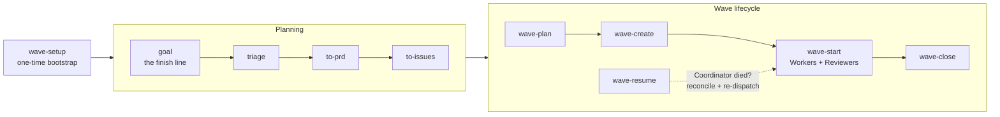

# flotilla

[](https://www.npmjs.com/package/@formtrieb/flotilla-engine)
[](https://github.com/formtrieb/flotilla/actions/workflows/verify.yml)
[](LICENSE)

> **Portable, Claude-Code-native wave-orchestration toolkit.** Plan a batch of independently-grabbable issues, dispatch parallel AFK agents in isolated worktrees, review each with a schema-validated verdict, land via PRs — with cross-wave **conflict/parallelism reasoning** as the universal core.

**Stable.** The orchestration has been driving flotilla's own development across fifty-plus live waves, and runs in installed form — plugin plus published engine — in independent consumer repos beyond this one, operated by more than one person. Three surfaces are semver contracts: the engine's package-root export surface, the `wave.config.json` schema (both since 1.0.0), and the CLI's output surface (since 1.1.0). [CHANGELOG.md](CHANGELOG.md) names what each release added and what remains unproven.

## What flotilla is

flotilla turns a backlog of tracker issues into a **wave**: a batch of independently-grabbable work items that a Coordinator plans, then dispatches to parallel AFK (away-from-keyboard) agents, each isolated in its own git worktree. Every agent's work is reviewed by a second, universal Reviewer agent before anything lands — the review returns a schema-validated verdict, not free prose, so routing to approve / request-changes / stop is deterministic rather than inferred. Landing happens via pull requests against a protected default branch; nothing is ever pushed directly to it.

## Quickstart

**Prerequisites:** Node 20.11 or newer (the engine's declared floor), git, a repository on GitHub or Bitbucket Cloud whose default branch is protected, and a tracker token resolvable through a lookup command.

flotilla installs as two pieces — the skills as a Claude Code plugin, the engine from the public npm registry — and nothing is copied into your repo. In Claude Code, inside the repo you want to run waves in:

1. **Install the plugin:**

   ```
   /plugin marketplace add formtrieb/flotilla
   /plugin install flotilla@formtrieb
   ```

2. **Run the `wave-setup` skill.** The one-time bootstrap: it interviews you on three things (your tracker, the label set that marks an issue agent-ready, your build/test commands), installs the engine pinned into your repo, and writes `wave.config.json` — the single binding every other skill reads (ADR-0032). It also does the unglamorous parts for you: scaffolds the credential lookup so no token ever lands in a settings file, prepares the permission allowlist a wave needs to run unattended (your harness lets no agent write its own settings file, so the skill stages the file and hands you one command to apply it), and preflights the live tracker and code-host preconditions before you ever plan a wave — on GitHub Issues that includes the label set a wave reads and writes, which the preflight names and — with `--create-missing-labels` — creates for you. Fix anything the preflights flag before continuing; measured on a fresh consumer, this step takes about twenty minutes, most of it those two hand-offs.

3. **Get a few issues wave-ready.** For an **issue that already exists**, that is two skills in order: `triage` works it into shape and marks it ready for an agent, then `to-issues` (decorate) writes the planning header — declared file scope, risk/worker classification — that `wave-plan` reads. Both, in that order, never one instead of the other: the readiness marker alone does not make an issue readable to the wave side. For a **plan or PRD**, `to-issues` alone slices it into ready issues carrying all of it. Hand-authoring in the same shape works too.

4. **Run the wave:** `wave-plan` shows what can run side by side (read-only — you pick the ids), `wave-create` materializes the batch, `wave-start` dispatches one isolated Worker per issue plus a Reviewer per Worker. It ends with every row as an open, reviewed PR — **flotilla never merges on its own.**

5. **Land the PRs, then `wave-close`.** It computes the advisory merge order, cleans up the agent worktrees, and archives the wave's record. Session died mid-wave? `wave-resume` picks up exactly where it stopped.

The full adoption path — every step above in detail, plus the preconditions that fail silently if skipped — is **[docs/ONBOARDING.md](docs/ONBOARDING.md)**. Read its checklist before your first real wave.

Found something wrong with flotilla itself while running it here? The `report` skill is the built-in, consent-first feedback funnel — it walks your agent through filing a fully-analyzed finding upstream, in flotilla's own house format, and never files anything without your explicit go-ahead.

## Five terms that carry the rest

The docs use a precise vocabulary; these five are enough to read everything else. The full glossary is [CONTEXT.md](CONTEXT.md).

| Term | What it is |
| --- | --- |
| **Wave** | One batch of independently-grabbable issues, dispatched to parallel agents in isolated worktrees, reviewed, and landed via PRs. |
| **Conflict map** | Pure set-intersection over each issue's declared file globs — answers *before dispatch* which work can safely run in parallel, both inside a wave and against what other waves already claimed. |
| **Claim** | The coarse state a wave writes to your tracker (`queued → in-flight → in-review`) so humans and concurrent waves can see what is taken. One-way: the tracker is a projection, never the authority. |
| **Spine** | The wave's durable, repo-local markdown record — a write-ahead log. It is what makes a killed Coordinator resumable. |
| **Reviewer** | The independent, read-only agent that re-runs your verify commands and checks every acceptance criterion before a PR opens, returning a schema-validated verdict — the ground truth for whether the work is actually done. |

**Capabilities, in three lines:** GitHub Issues and Linear both ship full tracker adapters — claim ledger, needs-attention, frontier — with Linear alone able to mirror that frontier back as a native Project/Initiative update. GitHub and Bitbucket Cloud both create and land PRs through the engine's own `host-pr` seam, never `gh`. Only GitHub can **arm** a PR to land itself once checks go green — Bitbucket Cloud's API has no per-PR auto-merge call, so `--auto` there merges what's already clean and leaves the rest for a human. The full dated, per-cell matrix: [docs/CAPABILITIES.md](docs/CAPABILITIES.md).

Cross-repo waves are proven too: two repos on two different code hosts, coordinated through one shared tracker, have run sister waves that resolve a cross-repo blocker purely by reading each other's claim status — see the cross-repo / cross-host row of [docs/CAPABILITIES.md](docs/CAPABILITIES.md) for the dated evidence.

## The pipeline



| Skill | Phase | What it does |
| --- | --- | --- |
| `wave-setup` | Bootstrap, once per repo | Interviews you on tracker, eligibility labels, and verify commands; installs the engine and writes `wave.config.json` — the one `engine.cli` binding every other skill reads. |
| `goal` | Planning | Manages a named finish line as a container on your tracker: cuts its opening frontier as bare placeholder tickets, curates who belongs, and reports what is still open. Read-only status pass; it never stamps readiness, never dispatches, and never declares the goal reached. |
| `triage` | Planning | Works an incoming issue into shape: categorize, reproduce, gather what's missing, mark it ready for an agent or a human. |
| `to-prd` | Planning | Captures a design conversation as a PRD, published as a tracker issue ready for slicing. |
| `to-issues` | Planning | Slices a plan or PRD into independently-grabbable issues — each with a declared file scope, risk/worker classification, and acceptance criteria — and writes that same planning header onto an already-triaged issue (decorate), which is what makes it readable to the wave side. |
| `wave-plan` | Wave lifecycle | Draws the wave-eligible candidate set and cross-checks it against what other waves already claimed. Read-only and advisory — you pick the ids. |
| `wave-create` | Wave lifecycle | Materializes the chosen ids into a durable spine (a write-ahead log) after DoR and conflict checks; sets the soft `queued` claim on each issue. |
| `wave-start` | Wave lifecycle | Dispatches a worktree-isolated Worker per row, then a universal Reviewer per Worker; routes each schema-validated verdict deterministically. Ends with every row in-review — it never merges. |
| `wave-close` | Wave lifecycle | Computes the advisory merge order, cleans up agent worktrees, archives the spine. Opt-in `--auto` arms the order-free PRs for auto-merge. |
| `wave-resume` | Wave lifecycle | Reconstructs a killed Coordinator's state from the spine, the live worktrees, and on-disk sidecars; re-dispatches only what actually needs it. |
| `wave-reviewer` | Wave lifecycle | The read-only pre-PR quality gate `wave-start` dispatches for every row: re-runs verify against the wave anchor, checks each acceptance criterion with evidence, predicts sibling merge conflicts. |
| `report` | Utility, consumer-side | Files a fully-analyzed finding *about flotilla itself* — found while running the installed plugin/engine in your repo — upstream at flotilla's repo in the house format. Consent-first: it never files without your explicit go. |
| `grill-with-docs` | Utility | Stress-tests a design decision against the domain model and the ADRs before it's built, updating the docs inline as decisions settle. |
| `wave-shared` | Library | The shared schemas and conventions the execution skills load; invoked by its siblings, never directly. |

The thing that stays true regardless of stack or tracker is the **conflict/parallelism reasoning**: every issue declares the file globs it touches, and a pure set-intersection over those globs answers *"how much work goes into one wave, and can two waves run side by side?"* Everything else — which tracker, which verify commands, which code host — is an adapter around that core.

## Architecture in one screen

flotilla is two layers: a pure engine that is already harness-agnostic, and adapters that diverge freely per consumer.


| Seam | What it is |
| --- | --- |
| **`IssueView`** | The canonical contract. Every adapter's whole job is `read(id) → IssueView` (id, risk, worker, declared files, blocked-by, acceptance criteria, coarse status) — the engine never knows which tracker an issue came from. |
| **`IssueStore`** | `create · read · transition · close · listOpen`, plus facets for triage state, needs-attention flagging, closing-probe reads, minimal authored-content amends, and the Goal container whose frontier is derived rather than written. |
| **`SpineStore`** | The per-wave orchestration spine as durable local markdown — the write-ahead log a killed Coordinator resumes from. |
| **Two-scope state** | Fine-grained states live only in the spine. The tracker sees a coarse projection — `available → queued → in-flight → in-review → done`, plus an orthogonal `needs-attention` flag — so humans and concurrent waves can see what is claimed. |
| **Conflict map** | `computeConflictMap` is wave-agnostic pure glob-set math: feed it `(candidate wave) ∪ (everything queued or in-flight)` and it answers directly whether two waves can run side by side. |

Two properties worth knowing before you read further: the engine ships as raw TypeScript with no build step (`tsc --noEmit` is the type gate), and its public API is a deliberate, drift-guarded list — every module export is either deliberately public at the package root or on a reason-carrying allowlist, and a symbol in neither fails the test suite. There is deliberately **no dispatch-host abstraction**: the engine calls no agent-harness primitives; the Claude Code skills *are* the dispatch driver, and the schema-validated-subagent-return guarantee (agents cannot silently fabricate a result) is a property of that driver.

## Using just the engine

That "no dispatch-host abstraction" property is also what makes the engine useful on its own. flotilla's Claude Code skills are one driver built on top of it — not the only one a team could build. Someone assembling an agent fleet on a different harness (Copilot, Cursor, an in-house driver) can `npm install @formtrieb/flotilla-engine` and get a harness-neutral reference implementation for the three primitives a multi-agent dispatch loop actually needs:

- **`computeConflictMap`** — pure set-intersection over each task's declared file globs. Feed it the file lists for a candidate batch plus whatever another fleet already has in flight, and it returns exactly the overlapping pairs, before anything is dispatched.
- **The wave state machine** — `transition`, plus the `ISSUE_STATES` / `IssueState` vocabulary it operates over: a pure `(state, event) → outcome` reducer with no notion of *how* a worker gets started or reviewed.
- **`computeMergeOrder`** — derives a safe PR landing order from a batch's declared file counts and branch ancestry, independent of who or what actually merges them.

What the engine never assumes: which harness dispatches an agent, how an agent is invoked, or which tracker holds an issue. Every one of these functions takes plain data in — globs, states and events, PR shapes — and returns plain data out; none of them touches an agent runtime, writes to a file, or calls a tracker API.

One worked call, against the real exported signature:

```ts
import { transition } from '@formtrieb/flotilla-engine';

const outcome = transition('dispatched', 'worker-done');
// → { type: 'transition', nextState: 'report-in' }
```

Everything named above lives on the package root — the same semver-contracted export surface the *Stable* paragraph at the top of this README already promises not to break silently.

## Going deeper

- **Adopting flotilla in your repo** — [docs/ONBOARDING.md](docs/ONBOARDING.md): the [Quickstart](#quickstart) above in full detail, the preconditions checklist, credential mechanics, and the vendor-copy fallback for repos that cannot install a plugin. Before the setup-time binding exists, `npx @formtrieb/flotilla-engine` prints the engine's verb list (exploration only — unpinned and slow; `wave-setup` replaces it with the pinned binding).
- **Why it works this way** — [docs/CHARTER.md](docs/CHARTER.md) for the architecture, [docs/adr/](docs/adr/) for the individual decisions with the options that were rejected and why.
- **The vocabulary in full** — [CONTEXT.md](CONTEXT.md), the domain glossary.
- **Contributing to flotilla itself?** Start with [CLAUDE.md](CLAUDE.md). Cutting a release? [docs/RELEASING.md](docs/RELEASING.md).

## License & provenance

flotilla is licensed under [Apache-2.0](LICENSE). Parts of it were seeded from other sources under their own terms — see [PROVENANCE.md](PROVENANCE.md) for the seed points and the retained upstream notices.
