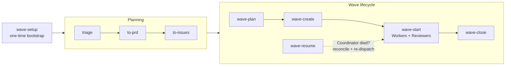
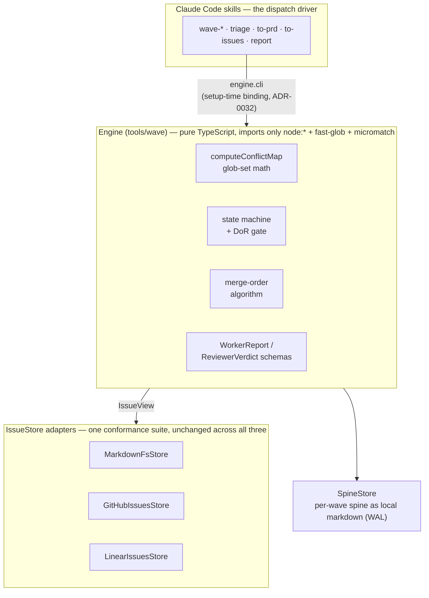

# flotilla

[](https://www.npmjs.com/package/@formtrieb/flotilla-engine)
[](https://github.com/formtrieb/flotilla/actions/workflows/verify.yml)
[](LICENSE)

> **Portable, Claude-Code-native wave-orchestration toolkit.** Plan a batch of independently-grabbable issues, dispatch parallel AFK agents in isolated worktrees, review each with a schema-validated verdict, land via PRs — with cross-wave **conflict/parallelism reasoning** as the universal core.

**Stable.** The orchestration has been driving flotilla's own development across fifty-plus live waves. Three surfaces are semver contracts: the engine's package-root export surface, the `wave.config.json` schema (both since 1.0.0), and the CLI's output surface (since 1.1.0). [CHANGELOG.md](CHANGELOG.md) names what each release added and what remains unproven.

## What flotilla is

flotilla turns a backlog of tracker issues into a **wave**: a batch of independently-grabbable work items that a Coordinator plans, then dispatches to parallel AFK (away-from-keyboard) agents, each isolated in its own git worktree. Every agent's work is reviewed by a second, universal Reviewer agent before anything lands — the review returns a schema-validated verdict, not free prose, so routing to approve / request-changes / stop is deterministic rather than inferred. Landing happens via pull requests against a protected default branch; nothing is ever pushed directly to it.

## The pipeline



| Skill | Phase | What it does |
| --- | --- | --- |
| `wave-setup` | Bootstrap, once per repo | Interviews you on tracker, eligibility labels, and verify commands; installs the engine and writes `wave.config.json` — the one `engine.cli` binding every other skill reads. |
| `triage` | Planning | Works an incoming issue into shape: categorize, reproduce, gather what's missing, mark it ready for an agent or a human. |
| `to-prd` | Planning | Captures a design conversation as a PRD, published as a tracker issue ready for slicing. |
| `to-issues` | Planning | Slices a plan or PRD into independently-grabbable, wave-eligible issues — each with a declared file scope, risk/worker classification, and acceptance criteria. |
| `wave-plan` | Wave lifecycle | Draws the wave-eligible candidate set and cross-checks it against what other waves already claimed. Read-only and advisory — you pick the ids. |
| `wave-create` | Wave lifecycle | Materializes the chosen ids into a durable spine (a write-ahead log) after DoR and conflict checks; sets the soft `queued` claim on each issue. |
| `wave-start` | Wave lifecycle | Dispatches a worktree-isolated Worker per row, then a universal Reviewer per Worker; routes each schema-validated verdict deterministically. Ends with every row in-review — it never merges. |
| `wave-close` | Wave lifecycle | Computes the advisory merge order, cleans up agent worktrees, archives the spine. Opt-in `--auto` arms the order-free PRs for auto-merge. |
| `wave-resume` | Wave lifecycle | Reconstructs a killed Coordinator's state from the spine, the live worktrees, and on-disk sidecars; re-dispatches only what actually needs it. |
| `wave-reviewer` | Wave lifecycle | The read-only pre-PR quality gate `wave-start` dispatches for every row: re-runs verify against the wave anchor, checks each acceptance criterion with evidence, predicts sibling merge conflicts. |
| `report` | Utility, consumer-side | Files a fully-analyzed finding *about flotilla itself* — found while running the installed plugin/engine in your repo — upstream at flotilla's repo in the house format. Consent-first: it never files without your explicit go. |
| `grill-with-docs` | Utility | Stress-tests a design decision against the domain model and the ADRs before it's built, updating the docs inline as decisions settle. |
| `wave-shared` | Library | The shared schemas and conventions the execution skills load; invoked by its siblings, never directly. |

The thing that stays true regardless of stack or tracker is the **conflict/parallelism reasoning**: every issue declares the file globs it touches, and a pure set-intersection over those globs answers *"how much work goes into one wave, and can two waves run side by side?"* Everything else — which tracker, which verify commands, which code host — is an adapter around that core.

## Architecture in one screen

flotilla is two layers: a pure engine that is already harness-agnostic, and adapters that diverge freely per consumer.



| Seam | What it is |
| --- | --- |
| **`IssueView`** | The canonical contract. Every adapter's whole job is `read(id) → IssueView` (id, risk, worker, declared files, blocked-by, acceptance criteria, coarse status) — the engine never knows which tracker an issue came from. |
| **`IssueStore`** | `create · read · transition · close · listOpen`, plus facets for triage state, needs-attention flagging, closing-probe reads, and minimal authored-content amends. |
| **`SpineStore`** | The per-wave orchestration spine as durable local markdown — the write-ahead log a killed Coordinator resumes from. |
| **Two-scope state** | Fine-grained states live only in the spine. The tracker sees a coarse projection — `available → queued → in-flight → in-review → done`, plus an orthogonal `needs-attention` flag — so humans and concurrent waves can see what is claimed. |
| **Conflict map** | `computeConflictMap` is wave-agnostic pure glob-set math: feed it `(candidate wave) ∪ (everything queued or in-flight)` and it answers directly whether two waves can run side by side. |

Two properties worth knowing before you read further: the engine ships as raw TypeScript with no build step (`tsc --noEmit` is the type gate), and its public API is a deliberate, drift-guarded list — every module export is either deliberately public at the package root or on a reason-carrying allowlist, and a symbol in neither fails the test suite. There is deliberately **no dispatch-host abstraction**: the engine calls no agent-harness primitives; the Claude Code skills *are* the dispatch driver, and the schema-validated-subagent-return guarantee (agents cannot silently fabricate a result) is a property of that driver.

## Getting started

flotilla installs as two pieces: the **skills** as a Claude Code plugin, and the **engine** from the public npm registry. In Claude Code, inside the repo you want to run waves in:

```
/plugin marketplace add formtrieb/flotilla
/plugin install flotilla@formtrieb
```

Then run the `wave-setup` skill. It interviews you on your tracker, your eligibility labels, and your verify commands, writes `wave.config.json`, and scaffolds the permission allowlist a wave needs to run unattended.

The engine binds at **setup time, not at call time** (ADR-0032): `wave-setup` installs `@formtrieb/flotilla-engine` into your repo and records the one invocation form every skill uses under `engine.cli` in `wave.config.json` — for a Node consumer, the pinned `./node_modules/.bin/flotilla-engine`. Before that binding exists, you can explore the verb list with the unpinned bootstrap form:

```bash
npx @formtrieb/flotilla-engine        # exploration only — unpinned and slow; wave-setup replaces it with the pinned binding
```

The full path — what `wave-setup` asks you, the preconditions that fail silently if skipped, and the vendor-copy fallback for repos that cannot install a plugin — is **[docs/ONBOARDING.md](docs/ONBOARDING.md)**.

Contributing to flotilla itself? Start with [CLAUDE.md](CLAUDE.md). Cutting a release? [docs/RELEASING.md](docs/RELEASING.md).

## License & provenance

flotilla is licensed under [Apache-2.0](LICENSE). Parts of it were seeded from other sources under their own terms — see [PROVENANCE.md](PROVENANCE.md) for the seed points and the retained upstream notices.
